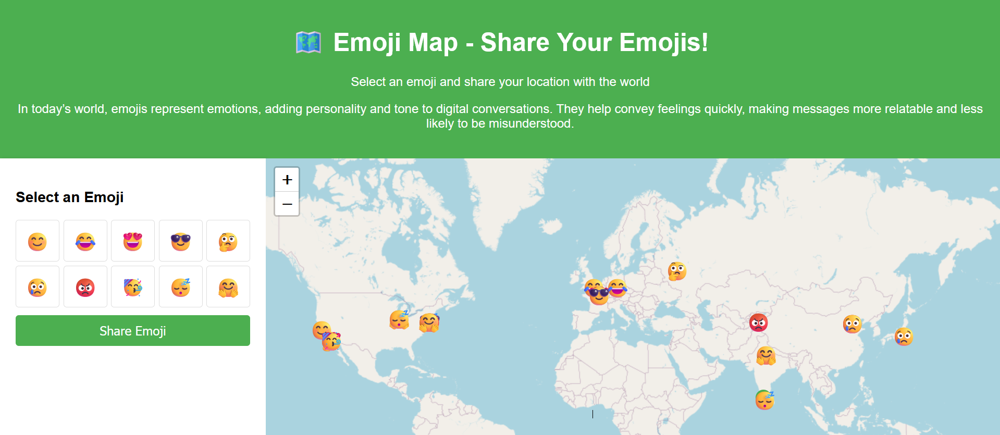
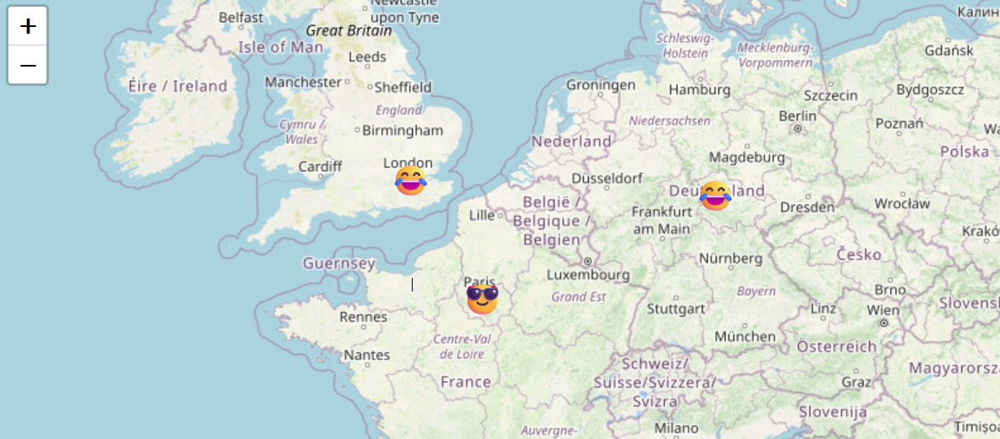
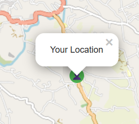
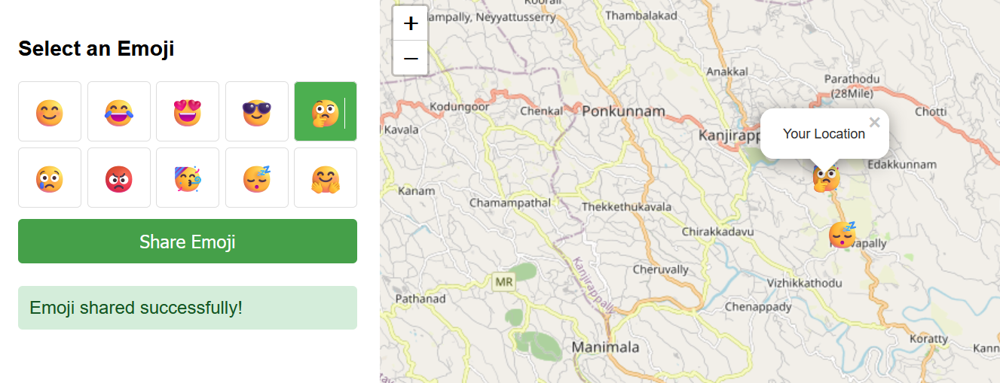

# Emoji Emotion Map

**Emoji Emotion Map** is a web application where users can submit emojis to represent their current emotions, along with their geographical location. The emoji and location data are stored in MongoDB and displayed on an interactive world map. Users from all over the world can contribute their emotions, and the map will show the emojis selected by people worldwide.

## Features

- **Submit Emoji**: Users can choose an emoji that best represents their current emotion.
- **Geolocation**: The user's location is captured automatically and stored alongside the emoji.
- **Interactive Map**: An interactive world map shows all emojis submitted by users around the globe.

## Tech Stack

- **Backend**: Django (Python), MongoDB
- **Frontend**: HTML, CSS, JavaScript
- **Map**: Leaflet.js

## Images

